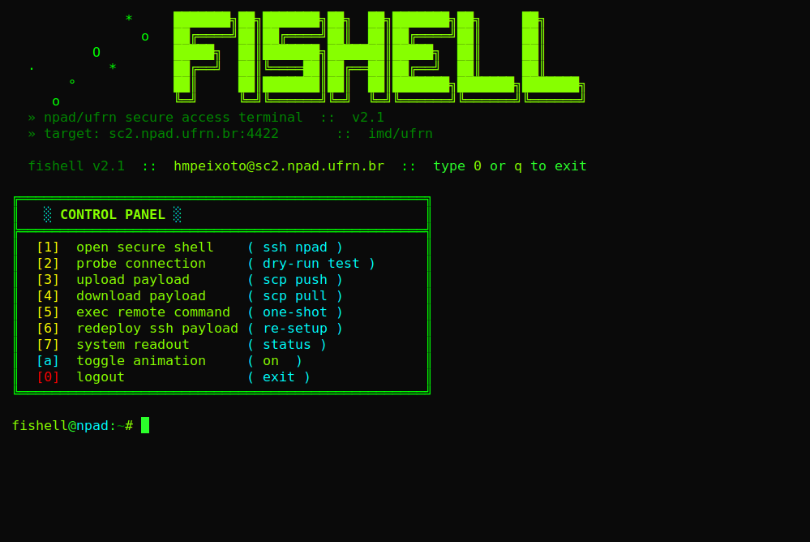

# fishell

Terminal SSH para acesso rápido ao **NPAD/UFRN** (supercomputador do IMD).
Configura chaves, registra alias `npad` e abre um painel interativo.

- **Linux / macOS / WSL / Google Colab** → `fishell.sh` (Bash)
- **Windows (PowerShell / cmd)** → `fishell.ps1` + `fishell.cmd` (launcher)



---

## Instalação (Linux / macOS / WSL / Colab)

```bash
git clone https://github.com/heltonmaia/fishell.git
cd fishell

# 1. Chaves SSH do NPAD vão em ./.ssh/
mkdir -p .ssh
cp ~/.ssh/id_rsa ~/.ssh/id_rsa.pub .ssh/

# 2. Configure seu usuário NPAD
cp config.sh.example config.sh
sed -i 's/seu_usuario_aqui/SEU_USER_NPAD/' config.sh

# 3. Rode
./fishell.sh
```

Na primeira execução, o script detecta que o SSH não está configurado,
faz o *setup* automaticamente e abre o painel.

---

## Instalação (Windows)

Requisitos: Windows 10+ com **OpenSSH Client** ativo (já vem por padrão;
se não: `Settings → Apps → Optional features → OpenSSH Client`) e
**Windows Terminal** recomendado para cores/animação.

```powershell
git clone https://github.com/heltonmaia/fishell.git
cd fishell

# 1. Chaves SSH vão em .\.ssh\
mkdir .ssh
copy $HOME\.ssh\id_rsa     .ssh\
copy $HOME\.ssh\id_rsa.pub .ssh\

# 2. Configure seu usuário NPAD
Copy-Item config.ps1.example config.ps1
notepad config.ps1   # edite $NPAD_USER

# 3. Rode (use o launcher .cmd pra não precisar mexer na ExecutionPolicy)
.\fishell.cmd
```

Pode também chamar com subcomando: `fishell.cmd setup | login | test |
upload | download | status | help`.

---

## Comandos

```bash
./fishell.sh              # painel interativo
./fishell.sh setup        # (re)configura o SSH
./fishell.sh login        # conecta (= ssh npad)
./fishell.sh test         # testa conexão
./fishell.sh upload       # scp push (interativo)
./fishell.sh download     # scp pull (interativo)
./fishell.sh status       # mostra configuração
./fishell.sh help         # ajuda
```

Depois do `setup`, o alias fica em `~/.ssh/config` e você pode usar SSH
direto de qualquer shell:

```bash
ssh npad
scp dados.zip npad:~/
scp npad:~/resultado.h5 .
```

Variáveis de ambiente:

| Var                | Efeito                                   |
| ------------------ | ---------------------------------------- |
| `FISHELL_NOANIM=1` | desativa typewriter/boot animation       |
| `NO_COLOR=1`       | desativa cores ANSI                      |

---

## Uso no Google Colab

Estrutura esperada no seu Google Drive:

```
Meu Drive/
└── visaocomputacional/
    └── .ssh/
        ├── id_rsa
        ├── id_rsa.pub
        └── known_hosts
```

No notebook:

```python
from google.colab import drive
drive.mount('/content/drive')

!git clone https://github.com/heltonmaia/fishell.git /content/fishell
%cd /content/fishell
!cp config.sh.example config.sh
!sed -i 's/seu_usuario_aqui/SEU_USER/' config.sh
!bash fishell.sh setup
```

O script detecta `/content/drive/MyDrive/visaocomputacional/.ssh`
automaticamente. Rode `bash fishell.sh setup` sempre que a VM do Colab
reiniciar.

---

## Troubleshooting

| Problema                          | Solução                                                            |
| --------------------------------- | ------------------------------------------------------------------ |
| `Permission denied (publickey)`   | Confirme `NPAD_USER` no `config.sh` e se a pub foi enviada ao NPAD |
| `chave privada não encontrada`    | `.ssh/id_rsa` deve existir, ou defina `SSH_KEYS_DIR` no config     |
| `Host key verification failed`    | `ssh-keygen -R '[sc2.npad.ufrn.br]:4422'` e rode `setup` de novo   |
| Timeout / conexão trava           | `./fishell.sh test` — se falhar, verifique firewall e porta 4422   |

---

## Segurança

`.ssh/`, `config.sh`, `*.zip`, `*.pem`, `*.key` estão no `.gitignore` —
**nunca** serão commitados. Se suspeitar de vazamento, gere um novo par
com `ssh-keygen` e atualize a pub no NPAD.

---

Mantido por **Helton Maia** · UFRN/IMD · `helton.maia@ufrn.br`
