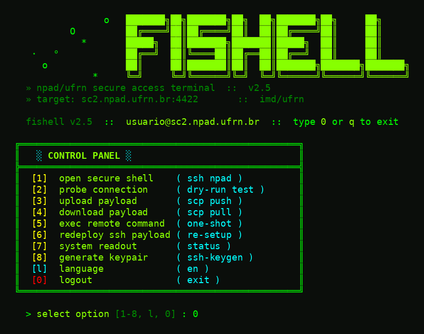

# fishell

Terminal SSH para acesso rápido ao **NPAD/UFRN** — o supercomputador do IMD.
Configura as chaves, registra o alias `npad` e abre um painel interativo, para
você não precisar decorar `ssh -p4422 usuario@sc2.npad.ufrn.br` nem os
comandos de `scp`.

[](https://github.com/heltonmaia/fishell/actions/workflows/ci.yml)

- **Linux / macOS / WSL / Google Colab** → `./bin/fishell.sh` (Bash)
- **Windows (PowerShell / cmd)** → `bin\fishell.cmd` (launcher do PowerShell)
- Interface em **português** (padrão) ou **inglês**


> Este README é um **resumo prático** para começar a usar o NPAD. A
> documentação oficial e completa está em [npad.ufrn.br](https://npad.ufrn.br)
> e nos [Tutoriais do NPAD](https://github.com/NPAD-UFRN/Tutorials). Dúvidas
> sobre a máquina: `atendimento@npad.ufrn.br`.

---

## Sumário

1. [Antes de tudo: conta no NPAD](#1-antes-de-tudo-conta-no-npad)
2. [Instalação](#2-instalação)
3. [O painel](#3-o-painel)
4. [Comandos](#4-comandos)
5. [Usando o NPAD: o essencial](#5-usando-o-npad-o-essencial)
6. [Fluxo típico de um trabalho](#6-fluxo-típico-de-um-trabalho)
7. [Troubleshooting](#7-troubleshooting)

---

## 1. Antes de tudo: conta no NPAD

O NPAD só aceita login **por chave SSH** — não existe senha. A ordem é:
gerar o par de chaves → cadastrar a chave **pública** → esperar o e-mail de
confirmação.

**1. Gere um par de chaves RSA.** O NPAD exige o tipo `rsa`.

```bash
git clone https://github.com/heltonmaia/fishell.git
cd fishell
./bin/fishell.sh keygen        # gera .ssh/id_rsa e .ssh/id_rsa.pub e mostra a pública
```

Ou, sem o fishell, o comando da documentação oficial: `ssh-keygen -t rsa`
(dê enter em todas as perguntas), e depois `cat ~/.ssh/id_rsa.pub`.

**2. Cadastre-se** em [Primeiros Passos](https://npad.ufrn.br/npad/primeirospassos),
colando a chave **pública** (`id_rsa.pub`) no formulário. Confira antes o seu
enquadramento na Política de Acesso para saber o tipo de usuário.

**3. Espere o e-mail** de confirmação. A partir daí você acessa o
supercomputador **da máquina que gerou o par de chaves**.

> A chave **privada** (`id_rsa`, sem `.pub`) nunca sai do seu computador e
> nunca vai para o formulário, para o Git ou para o WhatsApp.

---

## 2. Instalação

### Linux / macOS / WSL / Colab

```bash
git clone https://github.com/heltonmaia/fishell.git
cd fishell

# 1. Coloque suas chaves em ./.ssh/  (ou gere com ./bin/fishell.sh keygen)
mkdir -p .ssh
cp ~/.ssh/id_rsa ~/.ssh/id_rsa.pub .ssh/

# 2. Diga qual é o seu usuário do NPAD
cp config/config.sh.example config.sh
sed -i 's/seu_usuario_aqui/SEU_USER_NPAD/' config.sh

# 3. Rode
./bin/fishell.sh
```

Na primeira execução ele detecta que o SSH não está configurado, faz o setup
sozinho e abre o painel.

### Windows

Precisa do **OpenSSH Client** (já vem no Windows 10+; se faltar:
`Settings → Apps → Optional features → OpenSSH Client`). O **Windows Terminal**
é recomendado para as cores e a animação.

```powershell
git clone https://github.com/heltonmaia/fishell.git
cd fishell

mkdir .ssh
copy $HOME\.ssh\id_rsa     .ssh\
copy $HOME\.ssh\id_rsa.pub .ssh\

Copy-Item config\config.ps1.example config.ps1
notepad config.ps1          # edite $NPAD_USER

.\bin\fishell.cmd           # o .cmd evita mexer na ExecutionPolicy
```

### Google Colab

Guarde as chaves no seu Drive:

```
Meu Drive/
└── visaocomputacional/
    └── .ssh/
        ├── id_rsa
        ├── id_rsa.pub
        └── known_hosts
```

No notebook:

```python
from google.colab import drive
drive.mount('/content/drive')

!git clone https://github.com/heltonmaia/fishell.git /content/fishell
%cd /content/fishell
!cp config/config.sh.example config.sh
!sed -i 's/seu_usuario_aqui/SEU_USER/' config.sh
!bash bin/fishell.sh setup
```

O fishell acha `/content/drive/MyDrive/visaocomputacional/.ssh` sozinho quando
`SSH_KEYS_DIR` está vazio. **Rode `setup` de novo toda vez que a VM do Colab
reiniciar** — o `~/.ssh` da VM é descartado junto.

Para rodar algo no NPAD direto de uma célula, sem abrir o painel:

```python
!bash bin/fishell.sh run "squeue -u SEU_USER"
```

---

## 3. O painel

Rodar sem argumento abre o painel. Cada tecla é uma ação — não precisa dar
ENTER.

| tecla | ação |
| ----- | ------------------------------------------------------------ |
| `1`   | abre o shell no NPAD (o mesmo que `ssh npad`)                 |
| `2`   | testa a conexão — handshake de 10 s, sem abrir shell          |
| `3`   | envia arquivo/pasta via `scp`                                 |
| `4`   | baixa arquivo/pasta via `scp`                                 |
| `5`   | roda **um** comando no NPAD e mostra a saída                  |
| `6`   | refaz o setup do SSH (recopia chaves, reescreve o alias)      |
| `7`   | mostra a configuração atual (usuário, host, porta, chaves)    |
| `8`   | gera um par de chaves novo                                    |
| `l`   | troca o idioma da interface (pt ⇄ en)                         |
| `a`   | liga/desliga a animação do banner                             |
| `0` ou `q` | sai                                                      |

### Idioma

Padrão **pt**. Para mudar de forma permanente, edite `FISHELL_LANG` no
`config.sh` (ou `config.ps1`); para uma execução só, use a variável de
ambiente; durante a sessão, a tecla `[l]`.

```bash
FISHELL_LANG=en ./bin/fishell.sh
```



---

## 4. Comandos

```bash
./bin/fishell.sh                    # painel interativo
./bin/fishell.sh setup              # (re)configura o SSH
./bin/fishell.sh login              # conecta (= ssh npad)
./bin/fishell.sh test               # testa a conexão
./bin/fishell.sh upload             # scp push (interativo)
./bin/fishell.sh download           # scp pull (interativo)
./bin/fishell.sh run "squeue"       # roda um comando no NPAD
./bin/fishell.sh keygen             # gera um par de chaves novo
./bin/fishell.sh status             # mostra a configuração
./bin/fishell.sh help               # ajuda (funciona sem config.sh)
```

Depois do `setup`, o alias fica no seu `~/.ssh/config` e o SSH normal
funciona de qualquer terminal, sem o fishell:

```bash
ssh npad
scp dados.zip npad:~/
scp npad:~/resultado.h5 .
```

### O que o `setup` faz no seu `~/.ssh`

1. Copia `id_rsa` (e `id_rsa.pub` / `known_hosts`, se existirem) para
   `~/.ssh/`, com permissão `600`.
2. Acrescenta ao `~/.ssh/config` um bloco delimitado:

```
# ── fishell: begin ──
Host npad
    HostName sc2.npad.ufrn.br
    Port 4422
    User SEU_USER
    IdentityFile ~/.ssh/id_rsa
    ServerAliveInterval 60
    ServerAliveCountMax 3
# ── fishell: end ──
```

Rodar `setup` de novo **reescreve** esse bloco em vez de duplicá-lo. Se você
já tinha um `Host npad` que não foi criado pelo fishell, ele **não mexe** e
avisa — remova o seu à mão ou troque o `SSH_ALIAS` no `config.sh`.

---

## 5. Usando o NPAD: o essencial

### Onde o seu programa roda

O supercomputador tem dois lugares muito diferentes, e confundir os dois é o
erro mais comum:

| | **nó de login** (`service0`) | **nós de computação** |
| --- | --- | --- |
| é onde você cai ao dar `ssh npad` | sim | não |
| para quê | editar arquivo, compilar, **testar** | rodar de verdade |
| como executa | `./meuscript` | `sbatch meuscript` |
| limite | ~30 min usando 1 core — e **bem menos** se usar mais CPUs; o processo é morto automaticamente | horas, conforme o `--time` do script |

**Nunca** deixe um treinamento rodando no nó de login: ele é derrubado, e você
atrapalha todo mundo que está logado.

### Submetendo um job

Um "script de job" é um shell script com diretivas `#SBATCH` no topo:

```bash
#!/bin/bash
#SBATCH --partition=amd-512     # em qual grupo de máquinas rodar
#SBATCH --time=0-0:30           # tempo máximo, no formato dias-horas:minutos

python treina.py
```

```bash
sbatch meujob.sh
# Submitted batch job 14518
```

A saída **não** aparece na tela: vai para `slurm-14518.out`, no mesmo
diretório. Veja com `cat slurm-14518.out`.

### Partições

Partição é como o NPAD agrupa as máquinas. Você escolhe com
`#SBATCH --partition=`:

| partição | para quê |
| --- | --- |
| `amd-512` | uso geral — na dúvida, comece aqui |
| `intel-*` | uso geral (variantes Intel) |
| `gpu-8-v100` | 8 GPUs NVIDIA V100 |
| `gpu-4-a100` | 4 GPUs NVIDIA A100 |

A lista completa e atualizada está na página de
[Hardware](https://npad.ufrn.br/npad/hardware) e no `sinfo`.

### Job com GPU

```bash
#!/bin/bash
#SBATCH --partition=gpu-4-a100
#SBATCH --gpus-per-node=1       # quantas GPUs por nó
#SBATCH --cpus-per-task=6
#SBATCH --time=0-03:00

source activate gpu             # ambiente conda com PyTorch para GPU
python treina.py
```

O PyTorch com suporte a GPU já vem instalado no ambiente conda `gpu`
(`conda activate gpu`). Por padrão o PyTorch usa **uma** GPU; para usar várias
é preciso `DataParallel`/`DDP` no seu código.

### Acompanhando a fila

| comando | o que faz |
| --- | --- |
| `squeue` | mostra a fila inteira |
| `squeue -u SEU_USER` | só os seus jobs |
| `squeue --start` | estimativa de quando cada job começa |
| `watch squeue` | atualiza a cada 2 s |
| `sinfo` | estado das partições e nós |
| `scancel 14518` | cancela um job seu |

Dá para consultar sem abrir shell nenhum:

```bash
./bin/fishell.sh run "squeue -u SEU_USER"
```

### Coisas que costumam pegar

- **Não existe `sudo`.** Precisa de algo que exija root? Fale com o
  `atendimento@npad.ufrn.br`.
- Instale suas dependências Python em um **ambiente conda seu**, não no
  sistema.
- O tempo (`--time`) é um limite: se estourar, o job é morto. Mas pedir tempo
  demais atrasa o agendamento — o Slurm encaixa jobs curtos mais cedo.

---

## 6. Fluxo típico de um trabalho

```bash
./bin/fishell.sh                        # abre o painel

# [3] enviar arquivos     →  ./meu_projeto   →  ~/
# [1] abrir shell seguro  →  compila, edita, testa rápido
#                            sbatch meujob.sh
#     exit                →  volta ao painel
# [5] executar comando    →  squeue -u SEU_USER
# [4] baixar arquivos     →  ~/resultados    →  ./
```

Ou tudo pela linha de comando:

```bash
./bin/fishell.sh upload                 # manda o projeto
./bin/fishell.sh run "cd meu_projeto && sbatch meujob.sh"
./bin/fishell.sh run "squeue -u SEU_USER"
./bin/fishell.sh download               # traz os resultados
```

---

## 7. Troubleshooting

| Problema | Solução |
| --- | --- |
| `Permission denied (publickey)` | Confira `NPAD_USER` no `config.sh` e se a chave **pública** foi cadastrada no NPAD |
| `chave privada não encontrada` | `./bin/fishell.sh keygen`, ou aponte `SSH_KEYS_DIR` para a pasta certa |
| `Host key verification failed` | O servidor trocou de chave. Confirme com o NPAD e então: `ssh-keygen -R '[sc2.npad.ufrn.br]:4422'` |
| Timeout / conexão trava | `./bin/fishell.sh test`; se falhar, verifique firewall e a porta 4422 |
| Alias `npad` não foi registrado | Já existia um `Host npad` seu no `~/.ssh/config` — veja a seção 4 |
| No Colab parou de funcionar | A VM reiniciou: rode `bash bin/fishell.sh setup` de novo |
| Job não roda / fica em fila | `squeue --start` para a previsão; `sinfo` para ver se a partição está ocupada |
| Banner/painel com lixo no Windows | Use o Windows Terminal; e `src/powershell/fishell.ps1` precisa estar salvo em UTF-8 **com BOM** |

---

## Estrutura

```
bin/                     entrypoints
  fishell.sh               Linux / macOS / WSL / Colab
  fishell.cmd              Windows
src/
  bash/fishell.sh          o programa, versão Bash
  powershell/fishell.ps1   o programa, versão PowerShell
config/                  templates (os *.example commitados)
docs/                    screenshots
tools/make-screenshot.py regenera o print do README a partir da UI real
```

`config.sh` / `config.ps1` (a sua config) e `.ssh/` (as suas chaves) ficam na
**raiz** do repo, bloqueados pelo `.gitignore`.

### Migrando para outra máquina

Depois do `git clone`, copie da máquina antiga o `config.sh` e a pasta `.ssh/`
inteira — os dois são gitignored de propósito. Na máquina nova, ajuste as
permissões (o SSH recusa a chave se estiverem frouxas):

```bash
cd ~/fishell
chmod 700 .ssh
chmod 600 .ssh/id_rsa .ssh/known_hosts
chmod 644 .ssh/id_rsa.pub
chmod +x bin/fishell.sh src/bash/fishell.sh
./bin/fishell.sh
```

---

## Desenvolvimento

Não há build nem dependências. Os dois ports (`src/bash/fishell.sh` e
`src/powershell/fishell.ps1`) são escritos à mão em paralelo: **toda mudança de
comportamento, texto de UI ou subcomando precisa entrar nos dois**, incluindo o
número de versão.

```bash
bash -n src/bash/fishell.sh bin/fishell.sh          # sintaxe
shellcheck src/bash/fishell.sh bin/fishell.sh       # se disponível

FISHELL_LANG=pt FISHELL_NOANIM=1 NO_COLOR=1 ./bin/fishell.sh </dev/null \
  | python3 .github/scripts/check_panel.py          # a caixa tem 50 colunas

python3 tools/make-screenshot.py                    # regenera o print do README
```

O CI roda isso nas duas línguas, mais o parser do PowerShell, o
PSScriptAnalyzer e checks de paridade entre os ports.

Dois detalhes que já causaram bug e estão protegidos por check:

- **`src/powershell/fishell.ps1` precisa continuar em UTF-8 com BOM.** O
  Windows PowerShell 5.1 lê `.ps1` sem BOM como ANSI, o que destrói o banner,
  as bordas do painel e as sentinelas do bloco no `~/.ssh/config`.
- **O painel é medido em colunas, não em bytes.** `printf '%-20s'` preenche por
  byte, então "conexão" desalinharia a caixa — daí o helper `pad`/`vlen`.

---

## Segurança

`.ssh/`, `config.sh`, `config.ps1`, `*.zip`, `*.pem`, `*.key` estão no
`.gitignore` — nunca serão commitados. Se suspeitar que sua chave privada
vazou, gere um par novo com `./bin/fishell.sh keygen` e cadastre a nova chave
pública no NPAD.

---

## Links oficiais do NPAD

- Portal: [npad.ufrn.br](https://npad.ufrn.br)
- Primeiros Passos e cadastro: [npad.ufrn.br/npad/primeirospassos](https://npad.ufrn.br/npad/primeirospassos)
- Tutoriais completos: [github.com/NPAD-UFRN/Tutorials](https://github.com/NPAD-UFRN/Tutorials)
- Hardware e partições: [npad.ufrn.br/npad/hardware](https://npad.ufrn.br/npad/hardware)
- Suporte: `atendimento@npad.ufrn.br`

## Licença

[MIT](LICENSE).

---

Mantido por **Helton Maia** · `helton.maia@ufrn.br` · [heltonmaia.com](https://heltonmaia.com)
