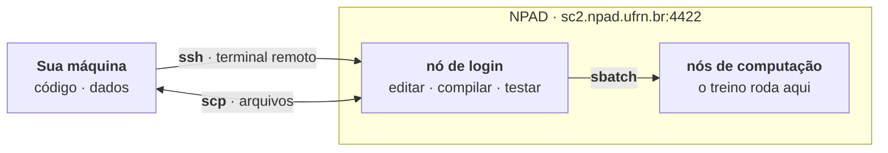

# fishell

Acesso rápido ao **NPAD/UFRN**, o supercomputador do IMD. Registra o alias
`npad`, guarda suas chaves onde o Colab não apaga, e reúne conectar, enviar,
baixar e rodar comando num painel, sem repetir `-p4422` em tudo.

Comece pela **parte 1**: o acesso na mão, sem ferramenta nenhuma.

[](https://github.com/heltonmaia/fishell/actions/workflows/ci.yml)


---

## Como funciona


```mermaid
flowchart LR
    A["<b>Sua máquina</b><br/>código · dados"]

    subgraph NPAD["NPAD · sc2.npad.ufrn.br:4422"]
        B["<b>nó de login</b><br/>editar · compilar · testar"]
        C["<b>nós de computação</b><br/>o treino roda aqui"]
        B -->|"<b>sbatch</b>"| C
    end

    A -->|"<b>ssh</b> · terminal remoto"| B
    A <-->|"<b>scp</b> · arquivos"| B
```

**`ssh`** te dá um terminal lá dentro; **`scp`** move arquivos. Você conecta no
*nó de login*. O trabalho pesado vai para os *nós de computação*, via
`sbatch`.

---

## 1. Acesso ao NPAD

Faça isso **na mão** primeiro. Se funcionar, o resto é conveniência; se não
funcionar, nenhuma ferramenta conserta.

### Gere sua chave

O NPAD só aceita login por chave, não existe senha. E a chave precisa ser
**RSA**. Dê enter em todas as perguntas:

```bash
ssh-keygen -t rsa
```

Se aparecer `already exists. Overwrite (y/n)?`, responda **n**: você já tem uma
chave e ela serve. Sobrescrever invalidaria os cadastros feitos com a antiga.

Isso cria `~/.ssh/id_rsa` (privada, nunca sai daí) e `~/.ssh/id_rsa.pub`
(pública, é a que você cadastra).

> O texto no fim da pública (`helton@notebook`) é só um rótulo, para você
> reconhecer a chave na lista do NPAD. Vai cadastrar mais de uma?
> `ssh-keygen -t rsa -C "colab"`.

### Cadastre a pública

```bash
cat ~/.ssh/id_rsa.pub
```

Copie a linha inteira e cadastre em
**[npad.ufrn.br → Primeiros Passos](https://npad.ufrn.br/npad/primeirospassos)**.
Se você já tem conta e está só adicionando uma máquina, o formulário é outro:
**[Adição de Chave](https://npad.ufrn.br/npad/chave)**.

Seu login chega por e-mail depois da aprovação.

> **O NPAD não te devolve nenhuma chave.** Ele guarda a sua pública no servidor;
> a privada fica só com você e é ela que responde ao servidor na hora de
> conectar. Não existe arquivo para baixar e salvar, diferente de senha ou
> certificado.

### Conecte

```bash
ssh -p4422 SEU_LOGIN@sc2.npad.ufrn.br
```

Não precisa apontar a chave: o `ssh` procura `~/.ssh/id_rsa` por conta própria,
que é onde o `ssh-keygen` acabou de salvar.

Deu certo? Você está no **nó de login**. Saia com `exit`.

Mandar e trazer arquivos é o mesmo endereço, com `-P` maiúsculo:

```bash
scp -P4422 dados.zip SEU_LOGIN@sc2.npad.ufrn.br:~/
scp -P4422 SEU_LOGIN@sc2.npad.ufrn.br:~/resultado.h5 .
```

> **No Colab**, o `~/.ssh` some quando a VM reinicia. Gere no Drive e aponte:
>
> ```bash
> ssh-keygen -t rsa -f /content/drive/MyDrive/SuaPasta/.ssh/id_rsa
> ssh -i /content/drive/MyDrive/SuaPasta/.ssh/id_rsa -p4422 SEU_LOGIN@sc2.npad.ufrn.br
> ```
>
> Repetir `-i` e `-p` em todo comando cansa, e é isso que a parte 3 resolve.

---

## 2. Por que o fishell

Com o acesso funcionando, o que sobra é repetição: a porta em todo comando, o
caminho longo em todo `scp`, e, no Colab, reinstalar a chave a cada reinício
da VM.

A [documentação do NPAD](https://github.com/NPAD-UFRN/Tutorials) já resolve a
primeira, ensinando a criar um alias no `~/.ssh/config`. O fishell escreve esse
bloco para você, guarda as chaves onde o Colab não apaga, e junta tudo num
painel.

Ele usa o mesmo `ssh` e o mesmo `scp`. Depois do `setup`, `ssh npad` funciona
até sem ele.

---

## 3. Instalar o fishell

**Google Colab**: abra o **Terminal** (ícone no canto inferior esquerdo) e
trabalhe por ele, com o Drive já montado. Daqui em diante é shell comum.

```bash
cd /content/drive/MyDrive/SuaPasta
git clone https://github.com/heltonmaia/fishell.git
cd fishell
cp config/config.sh.example config.sh
```

**Linux · macOS · WSL**

```bash
git clone https://github.com/heltonmaia/fishell.git
cd fishell
chmod +x bin/fishell.sh src/bash/fishell.sh
cp config/config.sh.example config.sh
```

**Windows**: precisa do OpenSSH Client (já vem no Windows 10+).

```powershell
git clone https://github.com/heltonmaia/fishell.git
cd fishell
Copy-Item config\config.ps1.example config.ps1
```

> No Colab use sempre `bash bin/fishell.sh`, nunca `./bin/fishell.sh`: o Drive
> é montado sem permissão de execução, e o `chmod` ali não adianta.

### Onde estão suas chaves

O clone traz uma pasta `.ssh/` vazia, e é ela que o `config.sh` usa por
padrão. Copie para lá a chave da parte 1:

```bash
cp ~/.ssh/id_rsa ~/.ssh/id_rsa.pub .ssh/
```

Prefere apontar em vez de copiar? O `config.sh` traz as alternativas
comentadas: `$HOME/.ssh` (onde o `ssh-keygen` salva por padrão) ou um caminho
completo qualquer.

**No Colab, use um caminho no Drive.** O `~/.ssh` fica na VM e some no
reinício, então as chaves precisam estar fora dela:

```bash
SSH_KEYS_DIR="/content/drive/MyDrive/SuaPasta/.ssh"
```

Assim o `setup` reinstala as chaves a cada sessão nova a partir do Drive, e
você não precisa cadastrar nada de novo no NPAD.

> **Mudou o `SSH_KEYS_DIR`? Rode o `setup` de novo.** Ele é quem instala as
> chaves no `~/.ssh`, e sem isso o `test` falha com
> `no such identity: ~/.ssh/id_rsa`, mesmo com o caminho certo no `config.sh`.

### Preencha seu login e rode

Troque `seu_usuario_aqui` pelo login do NPAD:

```bash
sed -i 's/seu_usuario_aqui/SEU_LOGIN/' config.sh
```

(No macOS o `sed` pede um argumento a mais: `sed -i '' 's/.../.../'`. Ou abra
no editor que preferir, é um shell script comum.)

```bash
./bin/fishell.sh setup     # instala as chaves e registra o alias npad
./bin/fishell.sh test      # confirma que conecta
./bin/fishell.sh           # abre o painel
```

No Colab, **repita o `setup` toda vez que a VM reiniciar**: o `~/.ssh` da
máquina virtual é descartado junto com ela, e é ele que o `ssh` consulta.

> `config.sh` e `.ssh/` são seus e não são versionados, de propósito, para o
> seu login e sua chave privada nunca irem parar num commit. A consequência:
> apagar e clonar o repo de novo leva os dois. Guardar as chaves fora da pasta
> do fishell, via `SSH_KEYS_DIR`, evita isso.

---

## 4. O painel

Cada tecla é uma ação, não precisa dar ENTER.

| tecla | ação |
| --- | --- |
| `1` | abre o shell no NPAD |
| `2` | testa a conexão, sem abrir shell |
| `3` | envia arquivo ou pasta |
| `4` | baixa arquivo ou pasta |
| `5` | roda **um** comando no NPAD e mostra a saída |
| `6` | refaz a configuração do SSH |
| `7` | mostra a configuração atual |
| `l` | troca o idioma (pt ⇄ en) |
| `0` | sai |

---

## 5. Comandos

Tudo que está no painel também funciona direto na linha de comando:

```bash
./bin/fishell.sh                  # painel
./bin/fishell.sh login            # conecta
./bin/fishell.sh test             # testa a conexão
./bin/fishell.sh upload           # envia (pergunta os caminhos)
./bin/fishell.sh download         # baixa
./bin/fishell.sh run "squeue"     # roda um comando no NPAD
./bin/fishell.sh setup            # refaz a configuração do SSH
./bin/fishell.sh help             # ajuda
```

Depois do `setup`, o SSH normal também funciona, de qualquer terminal:

```bash
ssh npad
scp dados.zip npad:~/
scp npad:~/resultado.h5 .
```

Para mudar o idioma de forma permanente, edite `FISHELL_LANG` no `config.sh`.

---

## 6. Usando o NPAD

### Onde o seu programa roda

| | **nó de login** | **nós de computação** |
| --- | --- | --- |
| é onde você cai ao conectar | sim | não |
| serve para | editar, compilar, **testar** | rodar de verdade |
| como executa | `./meuscript` | `sbatch meuscript` |
| limite | ~30 min com 1 core, e **bem menos** com mais CPUs; depois o processo é morto | horas, conforme o `--time` do script |

**Nunca** deixe um treinamento no nó de login: ele é derrubado, e você atrapalha
todo mundo que está logado.

### Submetendo um job

Um "script de job" é um shell script com diretivas `#SBATCH` no topo:

```bash
#!/bin/bash
#SBATCH --partition=amd-512     # onde rodar
#SBATCH --time=0-0:30           # tempo máximo (dias-horas:minutos)

python treina.py
```

```bash
sbatch meujob.sh        # → Submitted batch job 14518
cat slurm-14518.out     # a saída vai para este arquivo, não para a tela
```

### Partições

| partição | para quê |
| --- | --- |
| `amd-512` | uso geral; na dúvida, comece aqui |
| `intel-*` | uso geral (variantes Intel) |
| `gpu-8-v100` | 8 GPUs NVIDIA V100 |
| `gpu-4-a100` | 4 GPUs NVIDIA A100 |

### Job com GPU

```bash
#!/bin/bash
#SBATCH --partition=gpu-4-a100
#SBATCH --gpus-per-node=1
#SBATCH --cpus-per-task=6
#SBATCH --time=0-03:00

conda activate gpu      # ambiente com PyTorch para GPU já instalado
python treina.py
```

Por padrão o PyTorch usa **uma** GPU; para várias é preciso `DataParallel` ou
`DDP` no seu código.

### Acompanhando a fila

| comando | o que faz |
| --- | --- |
| `squeue -u SEU_LOGIN` | seus jobs |
| `squeue --start` | estimativa de quando cada job começa |
| `sinfo` | estado das partições |
| `scancel 14518` | cancela um job seu |

Dá para consultar sem abrir shell nenhum:

```bash
./bin/fishell.sh run "squeue -u SEU_LOGIN"
```

### Um fluxo típico

```bash
./bin/fishell.sh upload                 # manda o projeto
./bin/fishell.sh run "cd meu_projeto && sbatch meujob.sh"
./bin/fishell.sh run "squeue -u SEU_LOGIN"
./bin/fishell.sh download               # traz os resultados
```

> Não existe `sudo` no NPAD. Precisa de algo com privilégio de administrador?
> Fale com o `atendimento@npad.ufrn.br`.

---

## Problemas comuns

| Problema | Solução |
| --- | --- |
| `no such identity: ~/.ssh/id_rsa` | Falta rodar `./bin/fishell.sh setup`, que é quem instala a chave ali |
| `Permission denied (publickey)` | Confira o login no `config.sh` e se a chave **pública** foi cadastrada |
| Não acho a pasta `.ssh/` | Começa com ponto, então é oculta: `ls -a` |
| `bad interpreter: Permission denied` | Falta permissão: `chmod +x bin/fishell.sh src/bash/fishell.sh`, ou, no Drive, use `bash bin/fishell.sh` |
| Conexão trava ou dá timeout | `./bin/fishell.sh test` mostra o erro do SSH e sugere a causa |
| `Host key verification failed` | Falta o `known_hosts`, ou o servidor trocou de chave. Veja abaixo |
| O alias `npad` não foi registrado | Você já tinha um `Host npad` no `~/.ssh/config`. Remova o seu, ou troque `SSH_ALIAS` no `config.sh` |
| No Colab, parou depois de um tempo | A VM reiniciou: `bash bin/fishell.sh setup` |
| Job fica parado na fila | `squeue --start` mostra a previsão; `sinfo` mostra se a partição está cheia |

---

### `known_hosts` ausente

O `status` mostra `✗ known_hosts`? O `test` usa `BatchMode` e não consegue
confirmar a identidade do servidor sozinho. Gere e **confira**:

```bash
ssh-keyscan -p4422 sc2.npad.ufrn.br > .ssh/known_hosts 2>/dev/null
ssh-keygen -lf .ssh/known_hosts
```

| tipo | fingerprint esperada |
| --- | --- |
| ED25519 | `SHA256:Lfjr9sC3MnZJj/27hWtDsQF5wJ6rTU0j62T3qFxpUgM` |
| RSA | `SHA256:mUQ9ZrO4/2PYJHKx2Jh/OwN8LbPzPkfbiqzNv84be1E` |
| ECDSA | `SHA256:PAAyt3VUyhhmNyZBVuWQB3b4w5XRh8gDTiaD+2Q3ef8` |

O `ssh-keyscan` aceita qualquer chave que o servidor apresentar. É a
comparação com a tabela que vira verificação. Não bateu? Não prossiga; fale com
`atendimento@npad.ufrn.br`.

---

## Links

- Documentação oficial do NPAD: [npad.ufrn.br](https://npad.ufrn.br) · [tutoriais completos](https://github.com/NPAD-UFRN/Tutorials)
- Cadastro e adição de chave: [Primeiros Passos](https://npad.ufrn.br/npad/primeirospassos) · [Adição de Chave](https://npad.ufrn.br/npad/chave)
- Suporte do NPAD: `atendimento@npad.ufrn.br`
- Contribuir ou entender o código: [docs/desenvolvimento.md](docs/desenvolvimento.md)

Licença [MIT](LICENSE) · Mantido por **Helton Maia** ·
[heltonmaia.com](https://heltonmaia.com)
