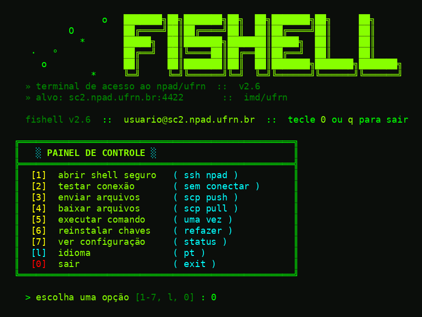

# fishell

Terminal SSH para acesso rápido ao **NPAD/UFRN** (supercomputador do IMD).
Copia as chaves, registra o alias `npad` e abre um painel interativo.

[](https://github.com/heltonmaia/fishell/actions/workflows/ci.yml)

- **Linux / macOS / WSL / Google Colab** → `./bin/fishell.sh` (Bash)
- **Windows (PowerShell / cmd)** → `bin\fishell.cmd` (launcher do PowerShell)



---

## Estrutura

```
bin/                     entrypoints
  fishell.sh               Linux / macOS / WSL / Colab
  fishell.cmd              Windows (chama o PowerShell sem mexer na ExecutionPolicy)
src/
  bash/fishell.sh          o programa, versão Bash
  powershell/fishell.ps1   o programa, versão PowerShell
config/                  templates (os *.example commitados)
docs/screenshot.png
tools/make-screenshot.py regenera o print do README a partir da UI real
```

`config.sh` / `config.ps1` (a sua config) e `.ssh/` (as suas chaves) ficam na
**raiz** do repo — fora do `src/`, e bloqueados pelo `.gitignore`.

---

## Instalação (Linux / macOS / WSL / Colab)

```bash
git clone https://github.com/heltonmaia/fishell.git
cd fishell

# 1. Chaves SSH do NPAD vão em ./.ssh/
mkdir -p .ssh
cp ~/.ssh/id_rsa ~/.ssh/id_rsa.pub .ssh/
#    (sem chave ainda? ./bin/fishell.sh keygen gera o par pra você)

# 2. Configure seu usuário NPAD
cp config/config.sh.example config.sh
sed -i 's/seu_usuario_aqui/SEU_USER_NPAD/' config.sh

# 3. Rode
./bin/fishell.sh
```

Na primeira execução, o script detecta que o SSH não está configurado, faz o
*setup* automaticamente e abre o painel.

---

## Instalação (Windows)

Requisitos: Windows 10+ com **OpenSSH Client** ativo (já vem por padrão; se
não: `Settings → Apps → Optional features → OpenSSH Client`) e **Windows
Terminal** recomendado para cores/animação.

```powershell
git clone https://github.com/heltonmaia/fishell.git
cd fishell

# 1. Chaves SSH vão em .\.ssh\
mkdir .ssh
copy $HOME\.ssh\id_rsa     .ssh\
copy $HOME\.ssh\id_rsa.pub .ssh\

# 2. Configure seu usuário NPAD
Copy-Item config\config.ps1.example config.ps1
notepad config.ps1   # edite $NPAD_USER

# 3. Rode (use o launcher .cmd pra não precisar mexer na ExecutionPolicy)
.\bin\fishell.cmd
```

Também aceita subcomando: `bin\fishell.cmd setup | login | test | upload |
download | run | keygen | forget | status | help`.

---

## Painel interativo

Rodar sem argumento abre o painel. Cada tecla é uma ação (não precisa dar
ENTER):

| tecla | ação |
| ----- | ---------------------------------------------------------- |
| `1`   | abre o shell no NPAD (equivale a `ssh npad`)                |
| `2`   | testa a conexão — handshake de 10 s, sem abrir shell        |
| `3`   | upload via `scp` (pergunta caminho local e remoto)          |
| `4`   | download via `scp`                                          |
| `5`   | executa **um comando** no NPAD e mostra a saída             |
| `6`   | refaz o setup do SSH (recopia chaves, reescreve o alias)    |
| `7`   | mostra a configuração atual (usuário, host, porta, chaves)  |
| `8`   | gera um par de chaves novo no diretório de chaves           |
| `9`   | esquece a host key do NPAD (`ssh-keygen -R`)                |
| `a`   | liga/desliga a animação do banner                           |
| `0` ou `q` | sai                                                    |

---

## Comandos

```bash
./bin/fishell.sh                    # painel interativo
./bin/fishell.sh setup              # (re)configura o SSH
./bin/fishell.sh login              # conecta (= ssh npad)
./bin/fishell.sh test               # testa conexão
./bin/fishell.sh upload             # scp push (interativo)
./bin/fishell.sh download           # scp pull (interativo)
./bin/fishell.sh run "nvidia-smi"   # roda um comando no NPAD e imprime a saída
./bin/fishell.sh keygen             # gera um par de chaves novo
./bin/fishell.sh forget             # remove a host key do NPAD do known_hosts
./bin/fishell.sh status             # mostra configuração
./bin/fishell.sh help               # ajuda (funciona sem config.sh)
```

Depois do `setup`, o alias fica no `~/.ssh/config` e você pode usar SSH direto
de qualquer shell:

```bash
ssh npad
scp dados.zip npad:~/
scp npad:~/resultado.h5 .
```

Variáveis de ambiente:

| Var                | Efeito                                   |
| ------------------ | ---------------------------------------- |
| `FISHELL_NOANIM=1` | desativa typewriter/boot animation       |
| `NO_COLOR=1`       | desativa cores ANSI                      |

---

## O que o `setup` faz no seu `~/.ssh`

1. Copia `id_rsa` (e `id_rsa.pub` / `known_hosts`, se existirem) do diretório
   de chaves para `~/.ssh/`, com permissão `600`.
2. Acrescenta ao `~/.ssh/config` um bloco delimitado por sentinelas:

```
# ── fishell: begin ──
Host npad
    HostName sc2.npad.ufrn.br
    Port 4422
    User SEU_USER
    IdentityFile ~/.ssh/id_rsa
    ServerAliveInterval 60
    ServerAliveCountMax 3
# ── fishell: end ──
```

Rodar `setup` de novo **reescreve** esse bloco em vez de duplicá-lo — então
mudar `NPAD_USER` ou `NPAD_PORT` no config e rodar `./bin/fishell.sh setup` já
basta.

Se você **já tinha** um `Host npad` no `~/.ssh/config` que não foi criado pelo
fishell, o script **não mexe nele** e avisa (`alias 'npad' exists ... kept as
is`). Nesse caso, ou remova/renomeie o seu bloco à mão, ou escolha outro
`SSH_ALIAS` no `config.sh`.

---

## Uso no Google Colab

Estrutura esperada no seu Google Drive:

```
Meu Drive/
└── visaocomputacional/
    └── .ssh/
        ├── id_rsa
        ├── id_rsa.pub
        └── known_hosts
```

No notebook:

```python
from google.colab import drive
drive.mount('/content/drive')

!git clone https://github.com/heltonmaia/fishell.git /content/fishell
%cd /content/fishell
!cp config/config.sh.example config.sh
!sed -i 's/seu_usuario_aqui/SEU_USER/' config.sh
!bash bin/fishell.sh setup
```

O script detecta `/content/drive/MyDrive/visaocomputacional/.ssh`
automaticamente quando `SSH_KEYS_DIR` está vazio. Rode `bash bin/fishell.sh setup`
sempre que a VM do Colab reiniciar.

Para rodar algo no NPAD direto de uma célula, sem painel:

```python
!bash bin/fishell.sh run "sinfo -s"
```

---

## Migrando para outra máquina (Linux / macOS / WSL)

Após `git clone`, copie os arquivos locais (bloqueados pelo `.gitignore`) da
máquina de origem: `config.sh` e a pasta `.ssh/` inteira (`id_rsa`,
`id_rsa.pub`, `known_hosts`).

Exemplo com `scp`:

```bash
scp config.sh  usuario@nova-maquina:~/fishell/
scp -r .ssh    usuario@nova-maquina:~/fishell/
```

Na máquina nova, ajuste as permissões — o SSH recusa a chave se `.ssh/` ou
`id_rsa` estiverem com permissão frouxa:

```bash
cd ~/fishell
chmod 700 .ssh
chmod 600 .ssh/id_rsa .ssh/known_hosts
chmod 644 .ssh/id_rsa.pub
chmod +x bin/fishell.sh src/bash/fishell.sh
./bin/fishell.sh
```

---

## Troubleshooting

| Problema                          | Solução                                                             |
| --------------------------------- | ------------------------------------------------------------------- |
| `Permission denied (publickey)`   | Confirme `NPAD_USER` no `config.sh` e se a pub foi enviada ao NPAD  |
| `chave privada não encontrada`    | `./bin/fishell.sh keygen`, ou aponte `SSH_KEYS_DIR` para a pasta certa  |
| `Host key verification failed`    | `./bin/fishell.sh forget` e conecte de novo                             |
| Timeout / conexão trava           | `./bin/fishell.sh test` — se falhar, verifique firewall e porta 4422    |
| Alias `npad` não foi registrado   | Já existia um `Host npad` seu no `~/.ssh/config` — veja a seção acima |
| Banner/painel com lixo no Windows | `src/powershell/fishell.ps1` foi salvo sem BOM UTF-8, ou o terminal não é o Windows Terminal |

---

## Desenvolvimento

Não há build nem dependências. Os dois ports (`src/bash/fishell.sh` e `src/powershell/fishell.ps1`)
são escritos à mão em paralelo: **toda mudança de comportamento, texto de UI ou
subcomando precisa entrar nos dois**, incluindo o número de versão.

Antes de commitar:

```bash
bash -n src/bash/fishell.sh              # sintaxe
shellcheck src/bash/fishell.sh bin/fishell.sh   # se disponível

FISHELL_NOANIM=1 NO_COLOR=1 ./bin/fishell.sh </dev/null \
  | python3 .github/scripts/check_panel.py    # a caixa do painel tem 50 colunas
```

O CI (GitHub Actions) roda isso mais o parser do PowerShell, o PSScriptAnalyzer
e dois checks de paridade entre os ports (mesma versão, mesmos subcomandos).

Mudou a UI (banner, menu, prompt)? Regenere o print do README — ele é gerado da
UI real, não tirado à mão:

```bash
python3 tools/make-screenshot.py     # precisa de Pillow + fonts-dejavu-core
```

**`src/powershell/fishell.ps1` precisa continuar salvo em UTF-8 com BOM.** O Windows
PowerShell 5.1 lê `.ps1` sem BOM como ANSI/Windows-1252, o que destrói o banner,
as bordas do painel e as sentinelas do bloco no `~/.ssh/config` — fazendo cada
`setup` duplicar o bloco. O CI bloqueia se o BOM sumir.

---

## Segurança

`.ssh/`, `config.sh`, `config.ps1`, `*.zip`, `*.pem`, `*.key` estão no
`.gitignore` — **nunca** serão commitados. Se suspeitar de vazamento, gere um
novo par com `./bin/fishell.sh keygen` e atualize a pub no NPAD.

---

## Licença

Licenciado sob os termos da [MIT License](LICENSE).

---

Mantido por **Helton Maia** · `helton.maia@ufrn.br` · [heltonmaia.com](https://heltonmaia.com)
